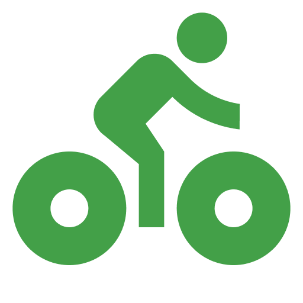
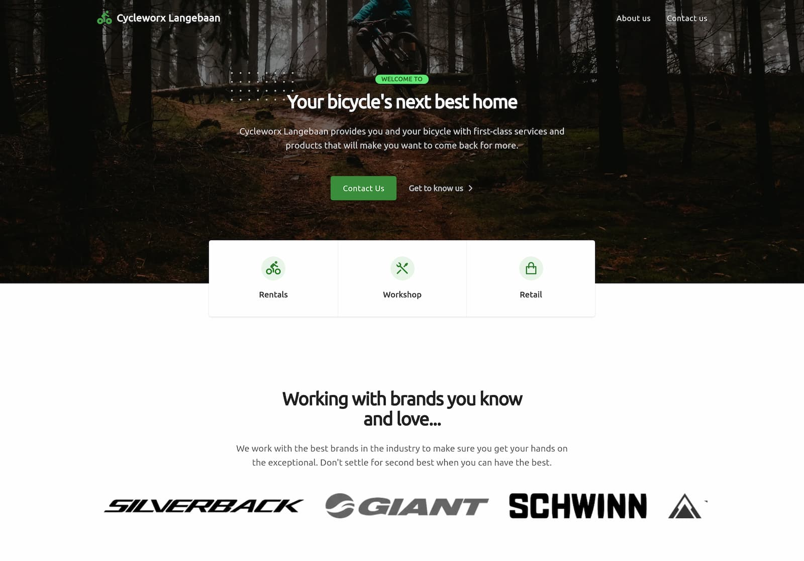
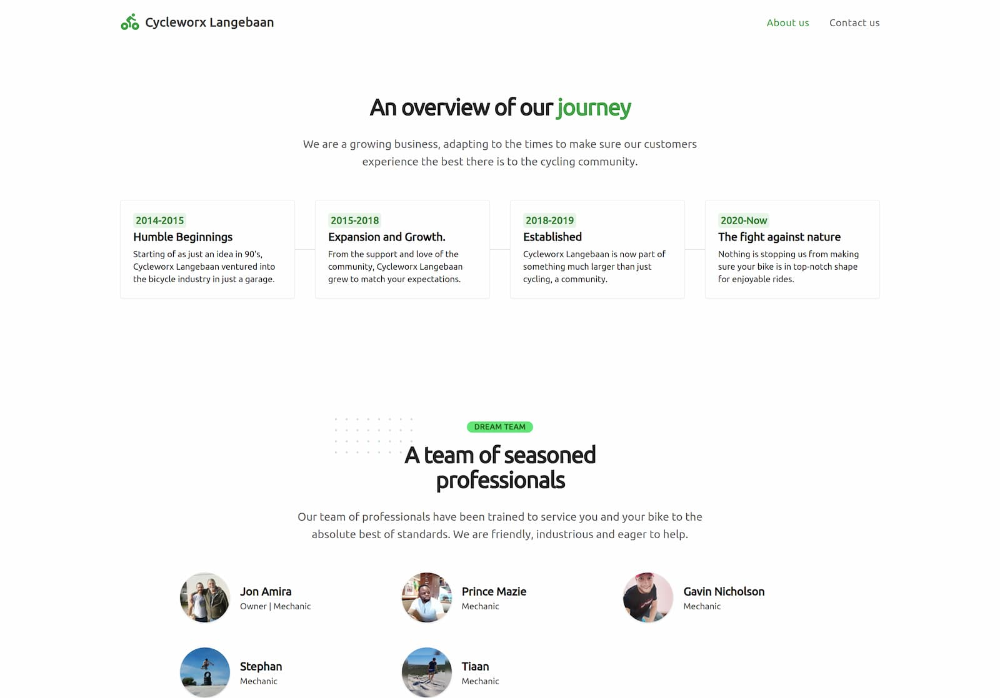
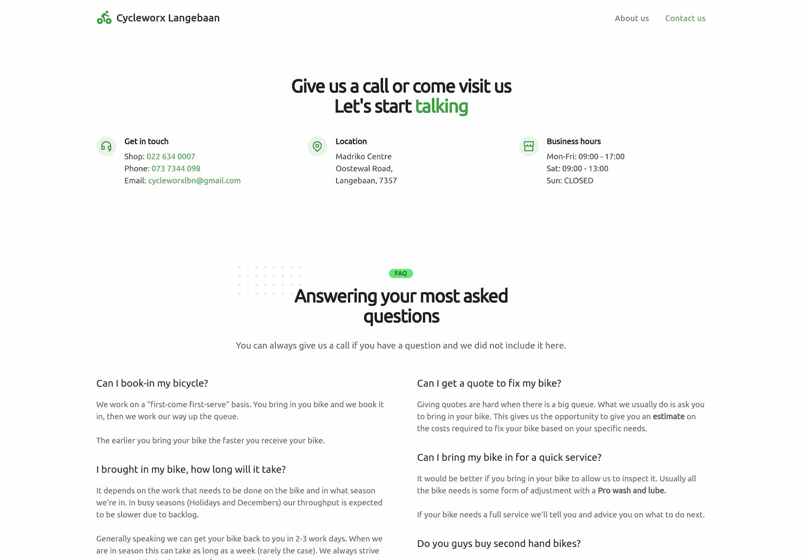

# Cycleworx Langebaan website

A local bicycle shop in my home town was looking to expand their online exposure. Needing to express their skills and professionalism, we agreed on revamping their old website to a more modern look and feel that accurately reflects who they are—resulting in a fast and good-looking website.

## Screenshots

 

 

## Tech Stack

**Client:**

## Related

Previous iterations of this project.

- [Cycleworx-v1](https://github.com/IamStephan/cycleworx-v1)
- [Cycleworx-v2](https://github.com/IamStephan/cycleworx-v2)

